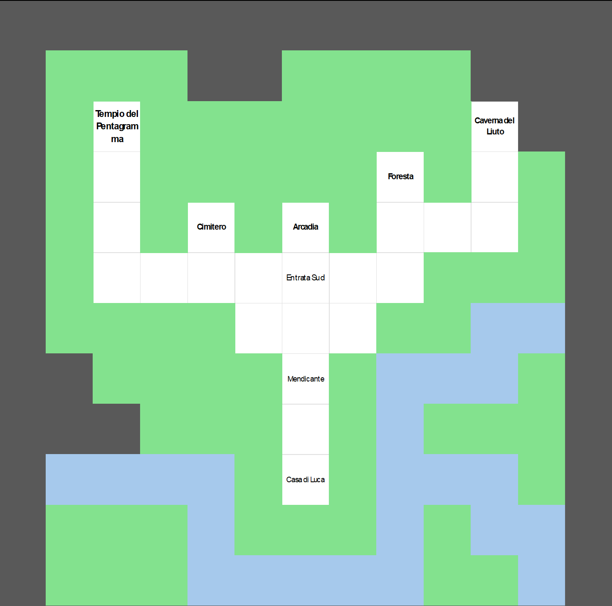
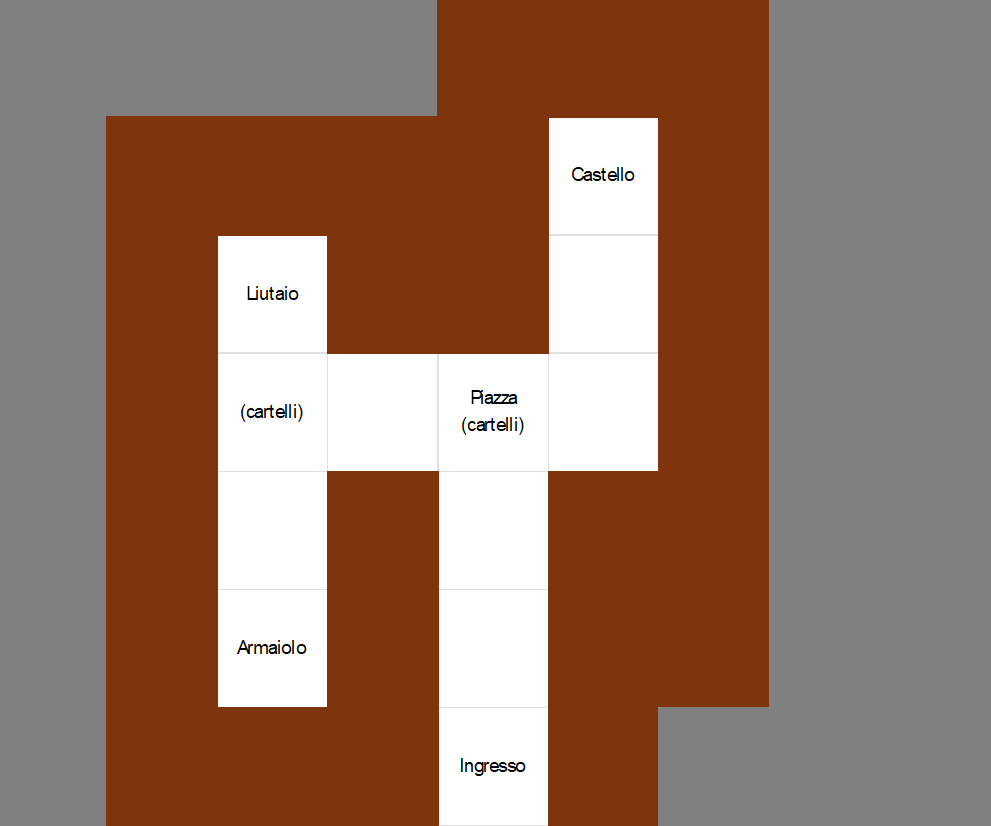
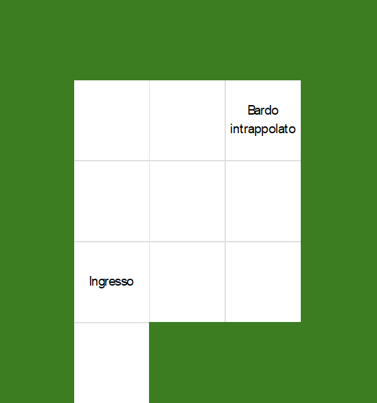
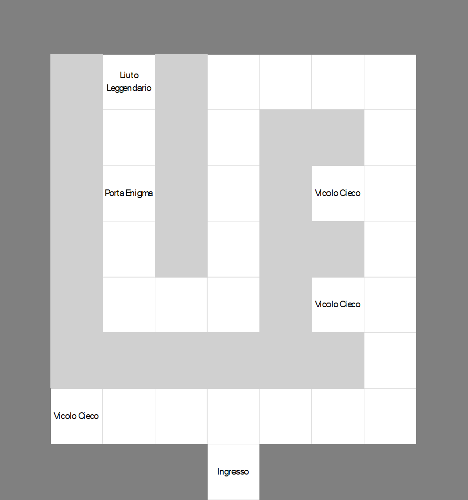
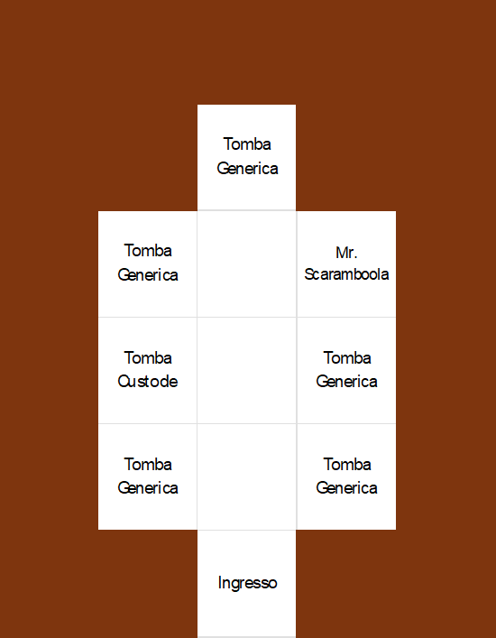
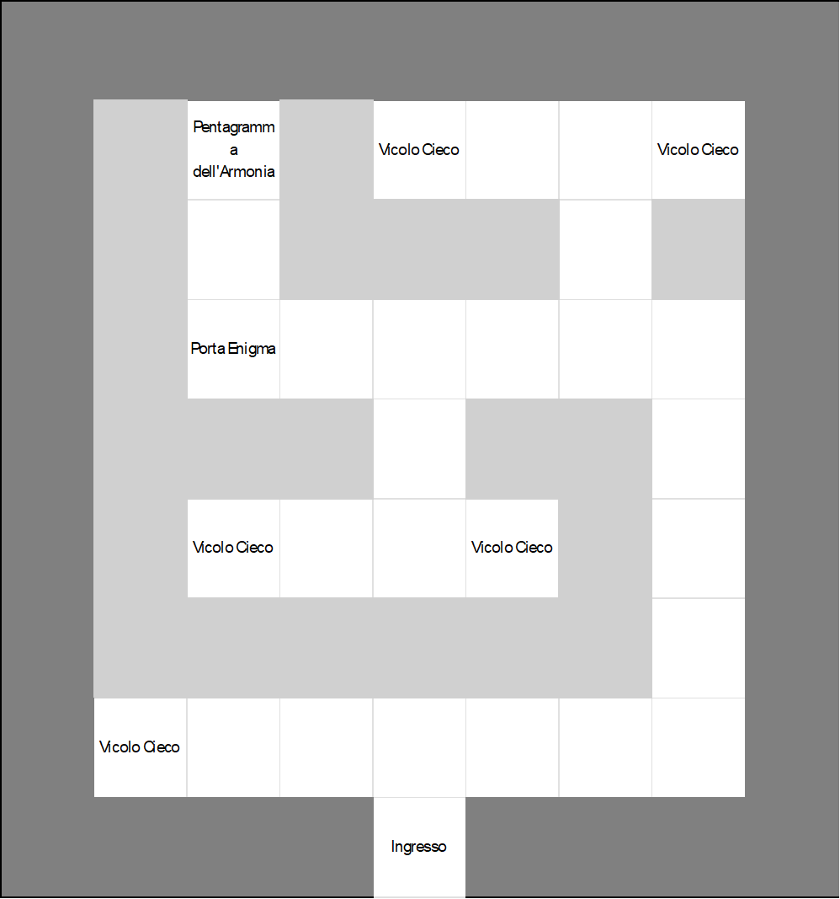

# Le Armonie del Custode
Progetto in Java, riguardante un'avventura testuale con Interfaccia Grafica, realizzato da:  
&nbsp;&nbsp;&nbsp;&nbsp;&nbsp;&nbsp;•&nbsp;&nbsp;&nbsp;&nbsp;[Alessandro Pellegrino](https://github.com/PellegrinoAl)  
&nbsp;&nbsp;&nbsp;&nbsp;&nbsp;&nbsp;•&nbsp;&nbsp;&nbsp;&nbsp;[Kevin Saracino](https://github.com/kelvinsrcn)  

## Indice

1. **Descrizione del caso di studio**
    1.1 **_Presentazione gioco_**
    1.2 **_Mappa di gioco (SPOILER)_**

2. **Soluzione del Gioco (SPOILER)**

### 1. Descrizione del caso di studio

Si è realizzata un'applicazione, scritta in linguaggio Java che vede la strutturazione di un'_avventura mista_, ossia un'avventura testuale con interfaccia grafica.

#### 1.1 Presentazione del gioco

Il _gioco_ prende il nome de: **_Le Armonie del Custode_**, la trama riguarda le avventure di un giovane pastore di nome Luca, che, con il suo liuto, allieta le giornate di tutti gli abitanti di Arcadia, un regno maestoso.

L'avventura inizia con la rottura del liuto di Luca, e sarà costretto ad andare al Regno per poterlo riparare, ma la strada è ancora lunga! Un attacco al Castello da parte di un Drago ha generato il terrore nel Regno, solo Luca potrà sistemare la situazione!

#### 1.2 Mappa del gioco

La Mappa di Gioco è la seguente:

    
Aprire per visualizzarla (SPOILER)

    <strong>Mondo Esterno: </strong>
      
     
    <strong>Arcadia: </strong>
      
     
    <strong>Foresta: </strong>
     
      
     
    <strong>Grotta del Liuto:</strong>
      
     
    <strong>Cimitero: </strong>
     
      
     
    <strong>Tempio del Pentagramma: </strong>
      

## 2. Soluzione del Gioco

Si riporta in seguito la soluzione per finire il gioco (percorso breve):

  
 Aprire per la soluzione (SPOILER) 

N x4  
PARLA  
321  
E x2  
N  
E x2  
N x3  
E x3  
N x6  
O x3  
S x4  
O x2  
N  
BALLA NNSSEO  
N x3  
PRENDI Liuto Leggendario  
S x4  
E x2  
N x4  
E x3  
S x6  
O x3  
S x3  
O x2  
S  
O x4  
N x3  
O  
PRENDI Chiave del Tempio  
E  
S x3  
O x2  
N x4  
E x3  
N x4  
O x4  
USA Chiave del Tempio  
O  
N x2  
PRENDI Pentagramma Armonico  
S x2  
E x5  
S x4  
O x3  
S x4  
E x4  
N x4  
E  
N x2  
USA Liuto Leggendario  
FINE

